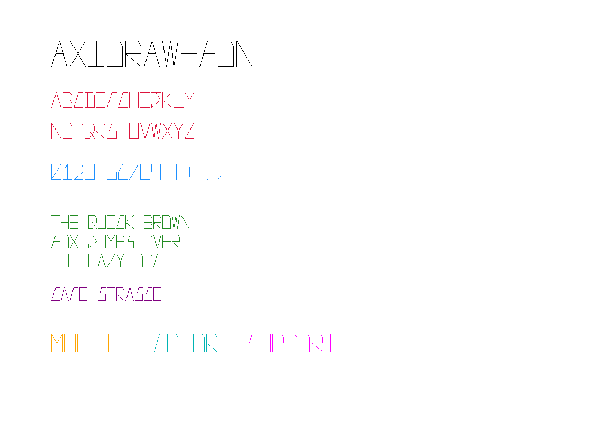
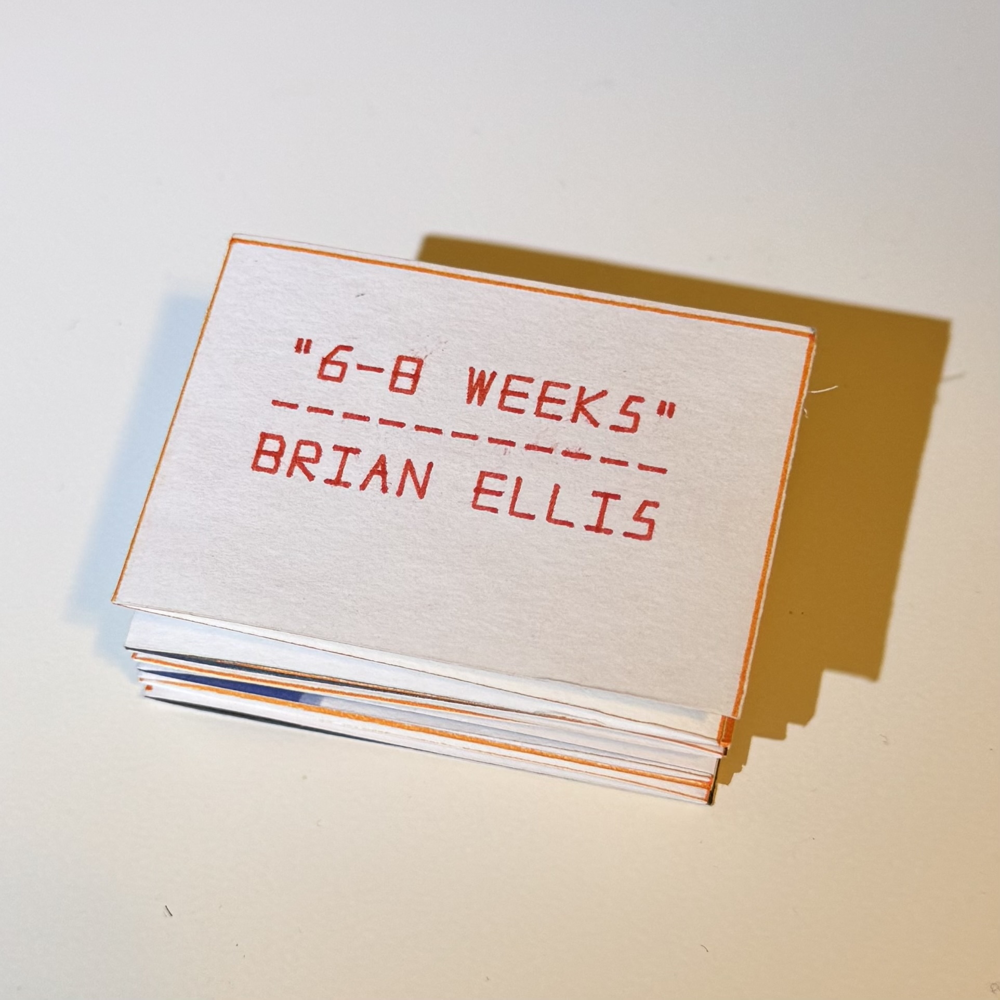
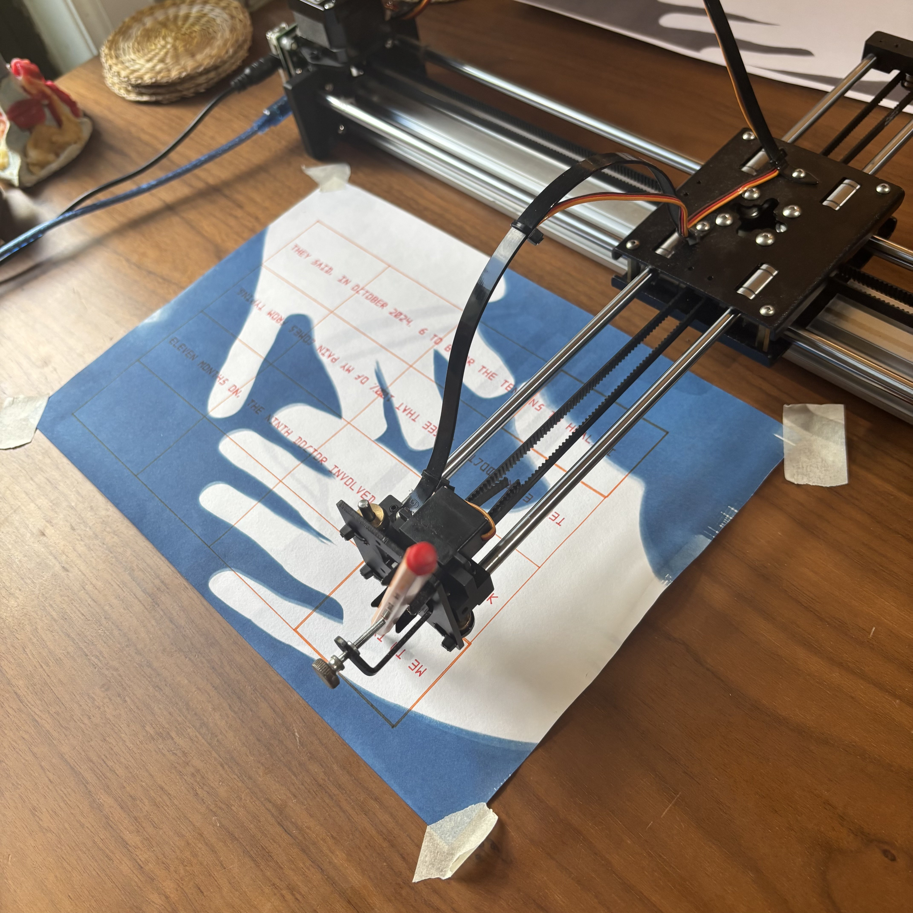

# axidraw-font

A single-stroke vector font and text rendering library for the [AxiDraw](https://www.axidraw.com/) pen plotter. Includes a dual-mode plotter wrapper that can render to a real AxiDraw or to a PNG preview image.



<p align="center">
  
  
  
</p>

## Features

- **Single-stroke vector font** — A-Z, 0-9, punctuation (`.,!?"-#%+`), and accented characters (`é`, `í`, `ß`)
- **DualPlotter** — One API for both real AxiDraw hardware and offline PNG preview (with auto-generated replay scripts)
- **Text rendering** — Single-line, word-wrapped, and rotated text drawing
- **Multi-color support** — Switch pen colors mid-drawing (image mode renders in color; device mode prompts for pen swap)
- **Envelope writing example** — Batch-write mailing addresses from a CSV, with sound alerts and progress tracking

## Files

| File | Description |
|------|-------------|
| `dual_text_lib.py` | Vector font definition + text drawing functions (`draw_text_line`, `draw_wrapped_text`, `draw_wrapped_text_rotated`) |
| `dual_plotter.py` | `DualPlotter` class — wraps AxiDraw API for real device or PNG output |
| `write_envelopes.py` | Example script: batch-write addresses on envelopes from a CSV |
| `example_addresses.csv` | Sample CSV showing the expected address format |

## Installation

```bash
pip install pillow
```

For real AxiDraw hardware, you also need `pyaxidraw` (included with the [AxiDraw software](https://wiki.evilmadscientist.com/Axidraw_Software_Installation)). It's not required for PNG preview mode.

## Quick Start

### Draw text to a PNG preview

```python
from dual_plotter import DualPlotter
from dual_text_lib import draw_text_line, draw_wrapped_text

# Create an offline plotter (renders to PNG)
ad = DualPlotter(use_device=False)
ad.interactive()
ad.connect()

# Draw a single line of text at (1, 1) inches, 0.3" tall
draw_text_line(ad, "Hello World", 1.0, 1.0, height_in=0.3)

# Draw wrapped text in a 4-inch-wide box
draw_wrapped_text(ad, "This is a longer sentence that will wrap automatically",
                  origin_x_in=1.0, baseline_y_in=2.0,
                  height_in=0.25, max_width_in=4.0)

ad.disconnect()  # saves PNG to zout/ and opens it
```

### Draw on a real AxiDraw

```python
ad = DualPlotter(use_device=True)
ad.interactive()
ad.connect()

draw_text_line(ad, "Hello from AxiDraw", 1.0, 1.0, height_in=0.3)

ad.moveto(0, 0)  # return pen home
ad.disconnect()
```

### Batch-write envelopes

1. Copy `example_addresses.csv` to `combined_addresses.csv` and fill in your addresses
2. Set `Done` to `TRUE` for any you want to skip
3. Run:

```bash
# Preview the first address as a PNG
python write_envelopes.py --test

# Write on real envelopes (plays a sound between each one)
python write_envelopes.py
```

The script marks each address as `Done=TRUE` in the CSV after plotting, so you can stop and resume anytime.

## Font Reference

The font is a minimal single-stroke design optimized for pen plotters. All glyphs are defined as polyline strokes in a normalized 0–1 coordinate space.

### Supported characters

```
A-Z  a-z  0-9
. , ! ? " - # % +
é í ß
(space)
```

Unknown characters render as `?`.

### Adding new glyphs

Add entries to the `FONT` dict in `dual_text_lib.py`:

```python
FONT['@'] = {'w': 1, 'strokes': [
    [(0.8, 0.2), (0.5, 0), (0.2, 0.2), (0, 0.5), (0.2, 0.8), (0.5, 1), (0.8, 0.8), (1, 0.5), (0.8, 0.2), (0.6, 0.4), (0.6, 0.6), (0.8, 0.6)]
]}
```

Each stroke is a list of `(x, y)` points where `(0,0)` is top-left and `(1,1)` is bottom-right of the glyph cell. Multiple strokes per glyph = multiple pen lifts.

## API Reference

### `DualPlotter(use_device, *, out_path, dpi, page_bbox_inches, line_px)`

| Parameter | Default | Description |
|-----------|---------|-------------|
| `use_device` | — | `True` for real AxiDraw, `False` for PNG output |
| `out_path` | `zout/z{timestamp}.png` | Output PNG path (image mode) |
| `dpi` | `100` | Image resolution |
| `page_bbox_inches` | `(0, 0, 11.69, 8.27)` | Canvas size in inches (default A4 landscape) |

Methods: `interactive()`, `connect()`, `moveto(x, y)`, `lineto(x, y)`, `confirmColorChange(color_name)`, `disconnect()`

### `draw_text_line(ad, text, origin_x_in, baseline_y_in, height_in=0.5, letter_spacing_em=0.12, word_spacing_em=None, font_scale=1.0)`

Draws a single line of text. All coordinates in inches.

### `draw_wrapped_text(ad, text, origin_x_in, baseline_y_in, height_in=0.6, max_width_in=5.0, ...)`

Draws text with automatic word wrapping. Returns the number of lines rendered.

### `draw_wrapped_text_rotated(ad, *, angle_deg, pivot_x_in, pivot_y_in, **kwargs)`

Same as `draw_wrapped_text` but rotated around a pivot point.

## Attribution

The single-stroke font was designed and edited by [Brian Ellis](https://github.com/kitchWWW), including plotting and testing all characters on the AxiDraw. AI tools (Claude) were used to facilitate library functions, documentation, and source control.

## License

MIT
